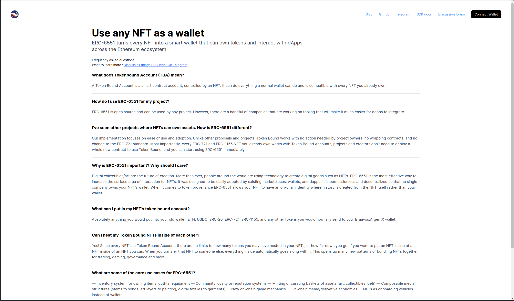

# Starknet-Tokenbound Explorer
Welcome to the Starknet-Tokenbound Explorer! This project serves as a powerful tool for interacting with the tokenbound account on starknet and exploring token-bound assets on the network. 

## Getting Started

### Clone repository
```bash
git clone https://github.com/Starknet-Africa-Edu/TBA.git
```

### Change directory to project
```bash
cd TBA
```

### Install Dependencies
```bash
yarn install
```

### Add Environment Variables
- NEXT_PUBLIC_ALCHEMY_API_KEY = <Provide an API key from Alchemy> (get your API key when you sign up on [Alchemy](https://auth.alchemy.com/signup))
- NEXT_PUBLIC_NETWORK = <starknet-mainnet | starknet-goerli>
- NEXT_PUBLIC_EXPLORER = <https://testnet.starkscan.co | https://starkscan.co>

### Run project
```bash
yarn dev
```

### Explorer Preview
*Explorer Preview.*



### SDK Documentation
For detailed information on the Starknet-tokenbound SDK and API, refer to the [Starknet-tokenbound SDK Documentation](https://tokenbound.gitbook.io/starknet-tokenbound/)
